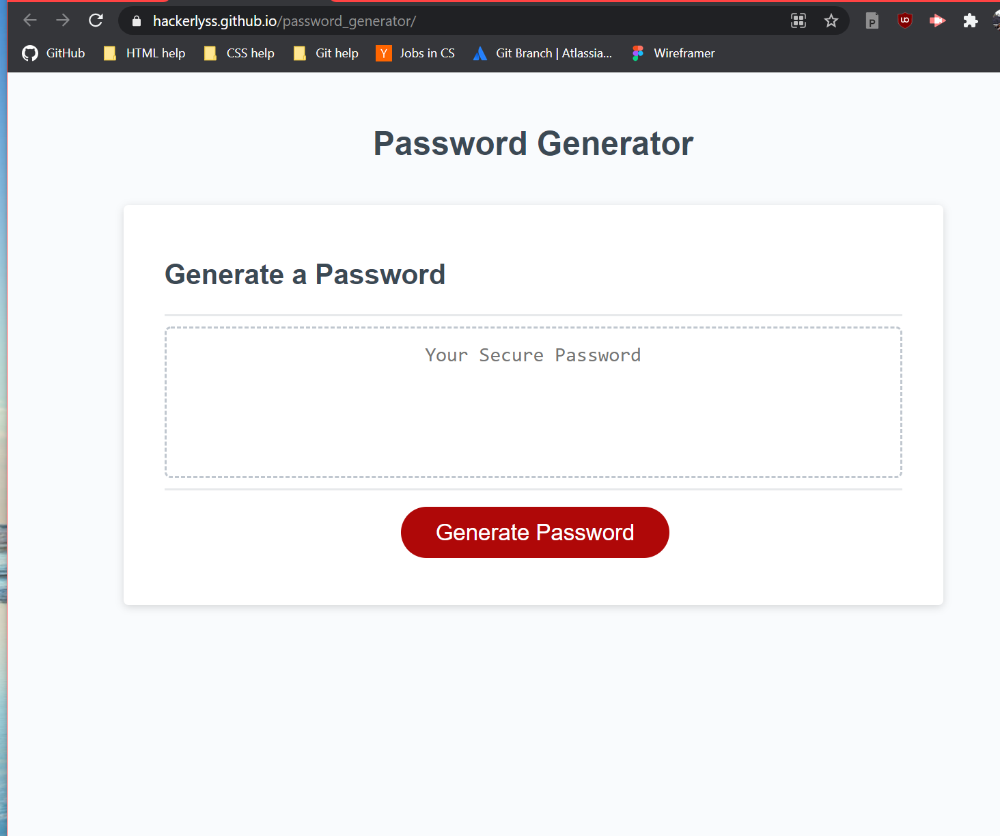
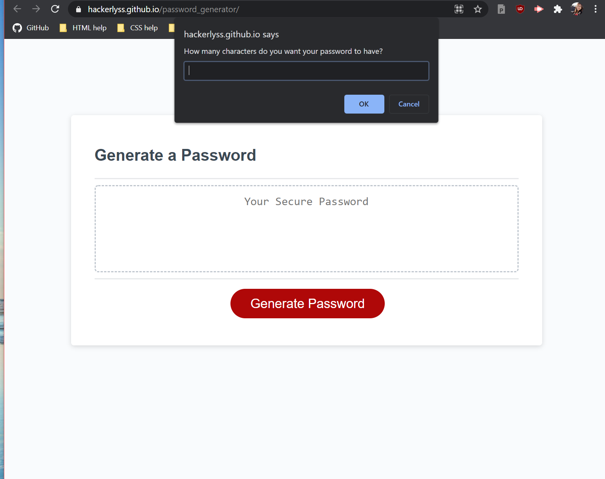
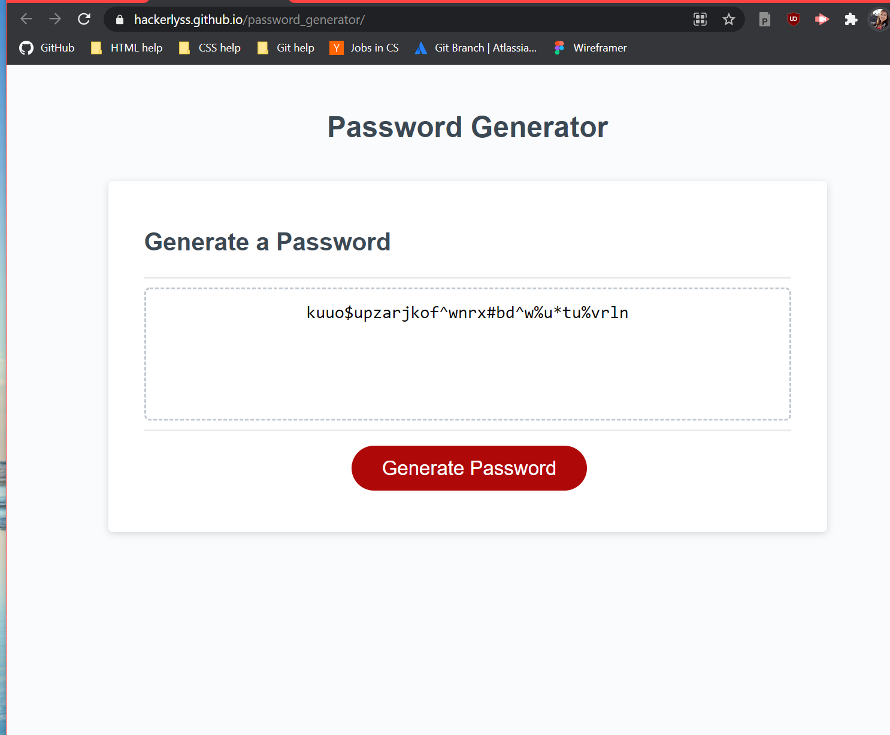

# password_generator
This is an application that will build the user a randomized password
based on the criteria the user has picked.

# Technologies Used:
HTML, CSS, JavaScript, VS Code

# Live links:
Here is the link to the deployed site: https://hackerlyss.github.io/password_generator/

# Website Previews
A look at the default site: 
A look at the prompts: 
A look at an example password 